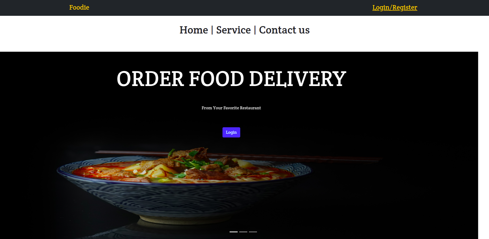
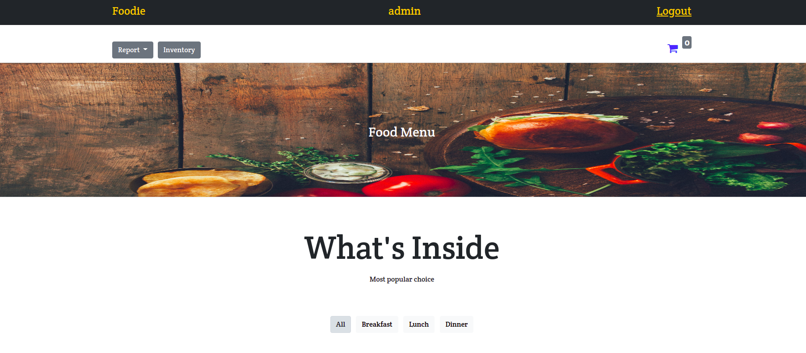
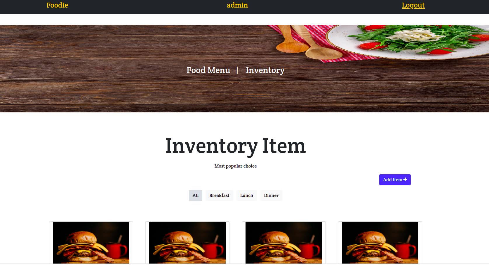

 

  

  <h3 align="center">FOODIE</h3>

  

    Order Now Eat Well ! 
     
     
     
  

  
Table of Contents

  <ol>
    <li> <a href="#about-the-project">About The Project</a></li>
    <li><a href="#reports-and-features">Reports and Features</a></li>
    <li><a href="#screenshots">Screenshots</a></li>
    <li><a href="#contact">Contact</a></li>
  </ol>

## About the Project

Online hotel management and food ordering web application. This project is mainly focus on tracking the inventory and management of orders. This application provides the provision to the manager to view the reports , edit the inventory , assign users to manage the system.
## Reports And Features 
<ul>
    <li>Sales Invoice Report</li>
    <li>Sales by Item Report</li>
    <li>Sale Order Report</li>
    <li>Stock Summary Report</li>
</ul>

## Screenshots 

## Contact 

[@kavin kumar](https://github.com/kavinkumar999)